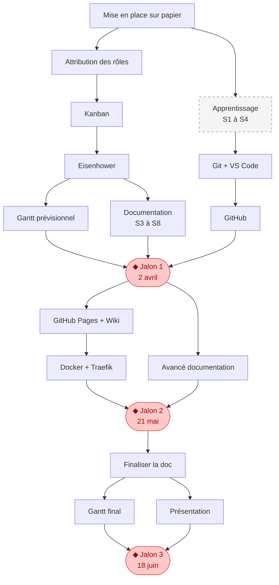

# 📅 Planification du Projet : Diagramme de Gantt

Ce document présente la planification du projet m431 sous forme de diagramme de Gantt. Il détaille les phases, les tâches, les responsabilités et les dépendances entre les étapes.

---

## Étape 1 : Les phases du projet 🗂️

Le projet est divisé en **4 phases** qui se déroulent sur **12 séances** (jeudis matin, mars → juin 2026). Trois jalons marquent les échéances imposées par le module.

### Phase 1 — Planification (S1 → S4)

| Tâche | Responsable | Début | Fin |
|-------|-------------|-------|-----|
| Mise en place sur papier | — | 12 mars | 12 mars |
| Attribution des rôles | Gabriel | 12 mars | 12 mars |
| Kanban | Jonathan | 12 mars | 19 mars |
| Eisenhower | Rafael | 19 mars | 26 mars |
| Gantt prévisionnel | Rafael | 26 mars | 2 avril |
| Documentation | Kevin | 26 mars | 21 mai |
| Pert *(optionnel)* | — | 26 mars | 2 avril |

### Phase 2 — Apprentissage (S1 → S4)

> L'apprentissage est un **bloc parent** : les sous-tâches techniques ne peuvent démarrer qu'une fois les outils maîtrisés (après fin S4).

| Tâche | Responsable | Début | Fin |
|-------|-------------|-------|-----|
| **Apprentissage** *(parent)* | Tous | 12 mars | 2 avril |
| → Git + VS Code | Tous | 12 mars | 12 mars |
| → GitHub | Tous | 19 mars | 26 mars |
| → GitHub Pages + Wiki | Kevin | 23 avril | 30 avril |
| → Docker + Traefik | Gabriel | 23 avril | 7 mai |

### ◆ Jalon 1 — Analyse et planification · 2 avril

---

### Phase 3 — Réalisation (S5 → S7)

| Tâche | Responsable | Début | Fin |
|-------|-------------|-------|-----|
| Avancé documentation | Kevin | 23 avril | 7 mai |

### ◆ Jalon 2 — Suivi et adaptation · 21 mai

---

### Phase 4 — Clôture (S10 → S12)

| Tâche | Responsable | Début | Fin |
|-------|-------------|-------|-----|
| Finaliser la doc | Kevin | 4 juin | 11 juin |
| Gantt final | Rafael / Jonathan | 4 juin | 11 juin |
| Présentation | Tous | 18 juin | 18 juin |

### ◆ Jalon 3 — Clôture · 18 juin

---
## Étape 2 : Les dépendances entre tâches 🔗

Chaque flèche indique qu'une tâche **doit être terminée avant** que la suivante puisse commencer.
Certaines tâches démarrent **en parallèle** dès qu'une tâche commune est lancée.

---

## Étape 3 : Les responsabilités 👥

| Membre | Rôle | Tâches principales |
|--------|------|--------------------|
| Gabriel | Chef de projet | Gestion d'équipe, avancée du projet, Wiki |
| Jonathan | Planification | Kanban, Gantt final |
| Rafael | Diagrammes | Eisenhower, Gantt prévisionnel, Gantt final |
| Kevin | Documentation | Documentation, GitHub Pages, Wiki |
| Tous | — | Apprentissage, Git + VS Code, GitHub, Présentation |