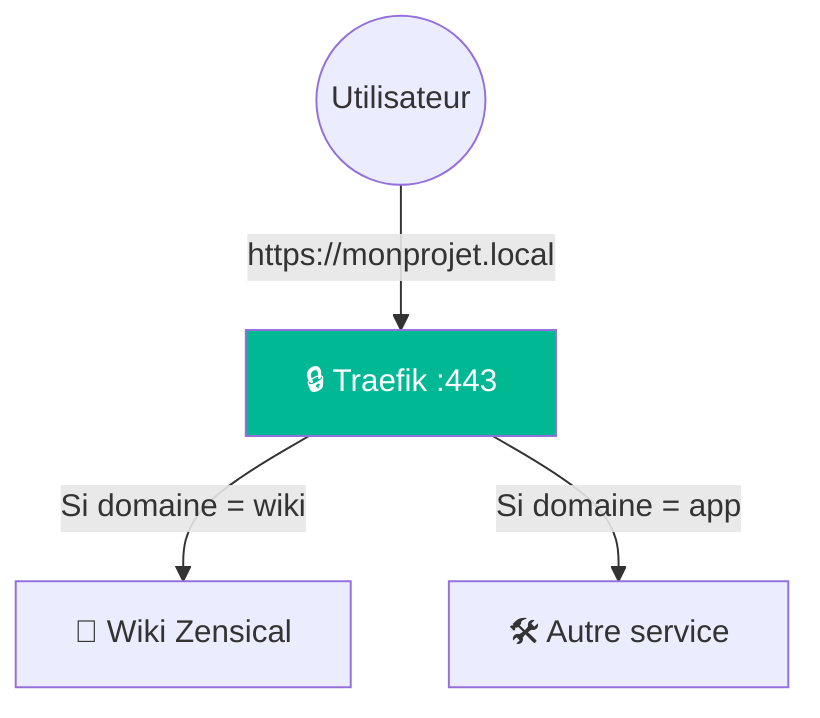
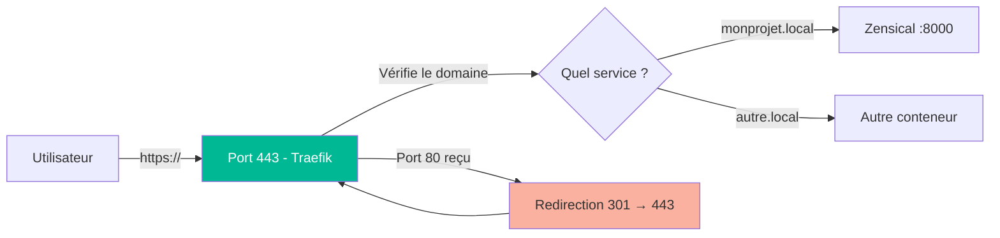

# 🔒 Traefik : Le Reverse Proxy du Projet

!!! warning "Prérequis obligatoires"
    Avant de continuer, assure-toi d'avoir lu et compris les pages suivantes :

    - [🐳 Docker](docker_explication.md) — lancer et gérer des conteneurs
    - [📝 YAML](syntaxe_yaml_explication.md) — syntaxe des fichiers de configuration
    - [🌐 Réseautage virtuel](reseautage_virtuel_explication.md) — comment les conteneurs communiquent
    - [🌍 Gestion DNS](gestion_dns_explication.md) — DuckDNS et nom de domaine

---

## Étape 1 : C'est quoi Traefik ? 🤔

Traefik est un **reverse proxy**. Concrètement, c'est le gardien de l'entrée : toutes les requêtes qui arrivent sur ton Raspberry Pi passent d'abord par lui, et il décide à quel conteneur les envoyer.

Sans Traefik, deux services ne pourraient pas écouter sur le même port 443 en même temps. Traefik résout ce problème en lisant le **nom de domaine** de la requête pour router vers le bon service.



---

## Étape 2 : HTTPS avec certificat auto-signé 🔐

Traefik peut générer **automatiquement** un certificat SSL auto-signé au démarrage — aucune commande à exécuter, aucun fichier à créer.

!!! warning "Avertissement navigateur"
    Un certificat auto-signé n'est pas reconnu par une autorité officielle. Le navigateur affichera un avertissement de sécurité la **première fois** que tu accèdes au site. Il suffit de cliquer sur **Avancé → Continuer quand même** pour l'accepter définitivement.

    C'est un comportement normal en environnement local — le trafic reste bien chiffré.

!!! note "Domaine local ou vrai domaine"
    Cette approche fonctionne dans les deux cas :

    - **Réseau local uniquement** : utilisez un nom comme `monprojet.local` configuré dans le fichier `hosts` de chaque machine (voir Étape 6)
    - **Avec un vrai domaine** (ex: DuckDNS) : remplacez simplement `monprojet.local` par `monprojet.duckdns.org` partout dans cette doc

---

## Étape 3 : Configuration du docker-compose.yml ⚙️

```yaml
services:

  traefik:
    image: traefik:v3              # Version stable de Traefik
    container_name: traefik
    restart: unless-stopped        # Redémarre automatiquement sauf si arrêté manuellement

    ports:
      - "80:80"                    # HTTP — redirigé automatiquement vers HTTPS
      - "443:443"                  # HTTPS — port principal sécurisé (SSL/TLS)

    command:
      # --- Dashboard (interface web de Traefik, utile pour déboguer) ---
      - "--api.dashboard=true"
      - "--api.insecure=false"           # Dashboard accessible uniquement via HTTPS

      # --- Découverte automatique des conteneurs Docker ---
      - "--providers.docker=true"
      - "--providers.docker.exposedbydefault=false"  # Seuls les conteneurs avec des labels Traefik sont exposés

      # --- Points d'entrée réseau ---
      - "--entrypoints.web.address=:80"              # Entrée HTTP sur le port 80
      - "--entrypoints.websecure.address=:443"       # Entrée HTTPS sur le port 443

      # --- Redirection automatique HTTP → HTTPS ---
      - "--entrypoints.web.http.redirections.entrypoint.to=websecure"
      - "--entrypoints.web.http.redirections.entrypoint.scheme=https"
      - "--entrypoints.web.http.redirections.entrypoint.permanent=true"  # Redirection 301 permanente

      # --- Certificat auto-signé (généré automatiquement par Traefik au démarrage) ---
      - "--entrypoints.websecure.http.tls=true"
        # Active TLS sur le port 443 — Traefik génère un certificat auto-signé si aucun autre n'est fourni

    volumes:
      - /etc/localtime:/etc/localtime:ro
    # Synchronise le fuseau horaire du conteneur avec celui du Raspberry Pi
    # Évite que les logs de Traefik affichent des heures décalées
      - /var/run/docker.sock:/var/run/docker.sock:ro
    # Permet à Traefik de lire la liste des conteneurs Docker (lecture seule pour la sécurité)

    networks:
      - proxy-net                  # Réseau partagé avec les autres services exposés

networks:
  proxy-net:
    external: true                 # Ce réseau est créé séparément (voir la page Réseautage virtuel)
```

---

## Étape 4 : Le fichier .env 🔑

Traefik lit ses variables sensibles depuis un fichier `.env` à la racine du projet.
**Ne jamais commit ce fichier sur GitHub** (il est dans le `.gitignore`).

```env
# Dossier de configuration (chemin absolu vers le dossier traefik/)
CONFIG_DIR=/home/pi/monprojet
```

---

## Étape 5 : Exposer un service via Traefik 🏷️

Pour qu'un conteneur soit accessible via Traefik, on lui ajoute des **labels** dans son `docker-compose.yml`. Ici, on prend comme exemple Zensical.

```yaml
services:

  zensical:
    image: zensical/zensical:latest
    restart: unless-stopped

    labels:
      - "traefik.enable=true"
        # Active Traefik pour ce conteneur (nécessaire car exposedbydefault=false)

      - "traefik.http.routers.wiki.rule=Host(`monprojet.local`)"
        # Règle de routage : si le domaine correspond, envoie vers ce conteneur
        # Remplace monprojet.local par ton domaine réel si besoin

      - "traefik.http.routers.wiki.entrypoints=websecure"
        # Ce routeur écoute uniquement sur le port 443 (HTTPS)

      - "traefik.http.routers.wiki.tls=true"
        # Active TLS sur ce routeur — utilise le certificat auto-signé de Traefik

      - "traefik.http.services.wiki.loadbalancer.server.port=8000"
        # Port interne du conteneur (Zensical écoute sur 8000)

    networks:
      - proxy-net                  # Doit être sur le même réseau que Traefik
```

---

## Étape 6 : Accéder au site depuis le réseau local 🌐

Si tu utilises un nom local (`monprojet.local`) sans vrai domaine, chaque machine du réseau doit savoir que ce nom pointe vers le Raspberry Pi. Pour ça, on modifie le fichier `hosts` de chaque machine.

=== "Windows"

    1. Ouvre le **Bloc-notes en tant qu'administrateur**
    2. Ouvre le fichier `C:\Windows\System32\drivers\etc\hosts`
    3. Ajoute cette ligne à la fin (remplace l'IP par celle de ton Raspberry Pi) :
    ```
    192.168.1.X   monprojet.local
    ```
    4. Sauvegarde et ferme

=== "macOS / Linux"

    ```bash
    # Ouvre le fichier hosts avec les droits admin
    sudo nano /etc/hosts

    # Ajoute cette ligne à la fin
    192.168.1.X   monprojet.local
    ```
    Enregistre avec `Ctrl+O` puis quitte avec `Ctrl+X`.

Ensuite, ouvre ton navigateur et accède à `https://monprojet.local`. Accepte l'avertissement de sécurité une seule fois → le site s'affiche.

---

## Étape 7 : Lancer et vérifier 🚀

```bash
# Créer le réseau proxy-net (une seule fois)
docker network create proxy-net

# Lancer Traefik
docker compose up -d

# Vérifier que Traefik tourne correctement
docker logs traefik

# Vérifier que TLS est bien actif
docker logs traefik | grep -i "tls\|certificate\|error"
```

### Résumé du flux complet :



